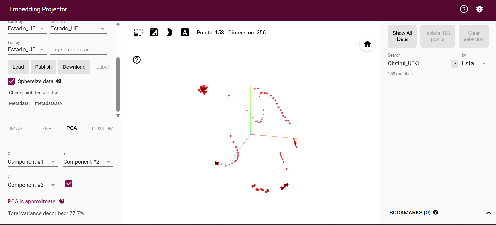

## Como iniciar
1. entrar no venv  
2. docker compose up -d na pasta config/  
3. Criar os Tópicos 
docker exec -it config-kafka-1 kafka-topics --create --topic VC_topic --bootstrap-server localhost:29092 --partitions 1 --replication-factor 1

docker exec -it config-kafka-1 kafka-topics --create --topic NC_topic --bootstrap-server localhost:29092 --partitions 1 --replication-factor 1

 Em 3 terminais diferentes:  
4. python src/python vertical_container.py  
5. python src/network_container.py  
6. python src/test_producer.py  

7. ver msgs em cada tópico no kafka -> http://localhost:8080/ 
    ou no terminal:   
docker exec -it config-kafka-1 kafka-console-consumer --bootstrap-server localhost:29092 --topic NC_topic --from-beginning

====================
Network Container:
1. Consumir a mensagem do tópico NC_topic.
2. Descomprimir o vetor: Usando a fórmula matemática inversa da quantização: Valor_{Float} = (Valor_{INT8} + 128) * scale + min_val
3. Avaliar o Espaço Latente: terá um algoritmo (provavelmente Reinforcement Learning ou um simples classificador Pytorch/SciKit) que aprendeu que, por exemplo, se a dimensão [4] do vetor for positiva e a dimensão [10] for muito negativa, isso significa "Vento Forte e Contentor em Queda".
4. Atuar na Rede: Com base nessa avaliação, o NC vai comunicar com a arquitetura O-RAN para alocar mais largura de banda (eMBB) para o vídeo ou priorizar latência (URLLC) para comandos de emergência.

=====

Pontos próximos: Significa que o porto está num estado praticamente idêntico  
Pontos afastados: Significa que o estado da rede e a posição dos obstáculos mudaram drasticamente  